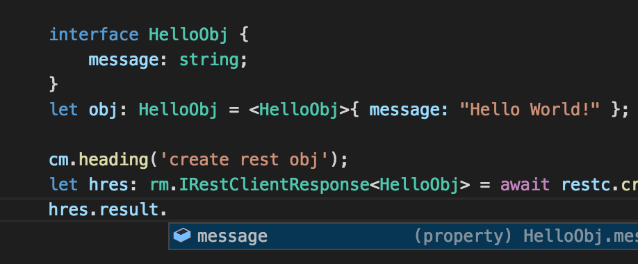

[](https://dev.azure.com/ms/typed-rest-client/_build/latest?definitionId=42&branchName=master)

# Typed Rest and HTTTP Client with TypeScript Typings

A lightweight Rest and HTTP Client optimized for use with TypeScript with generics and async await.

## Features

  - Rest and HTTP Client with typescript generics and async/await/Promises
  - Typings included so no need to acquire separately (great for intellisense and no versioning drift)
  - Basic, Bearer and NTLM Support out of the box.  Extensible handlers for others.
  - Proxy support
  - Certificate support (Self-signed server and client cert)
  - Redirects supported

Intellisense and compile support from typing the REST calls:


## Install the library
stable:
```
npm install typed-rest-client --save
```

latest preview:
```
npm install typed-rest-client@preview --save
```

# Build

Build:  
```bash
$ npm run build
```

# Test

To run all tests:
```bash
$ npm test
```

To just run unit tests:
```bash
$ npm run units
```

## Samples

See [samples](./samples) for complete coding examples

Also see [rest](./test/tests/resttests.ts) and [http](./test/tests/httptests.ts) tests for detailed examples.

## Errors

### http
The http client does not throw unless truly exceptional.  A request that successfully executes resulting in a 404, 500 etc... will return a response object with a status code and a body.  Redirects (3xx) will be followed by default.

See [http tests](./test/tests/httptests.ts) for detailed examples.

### rest
The rest client is a high level client which uses the HTTP client.  It's responsibility is to turn a body into a typed resource object.  

A 200 will be success.  
Redirects (3xx) will be followed.  
A 404 will not throw but the result object will be null and the result statusCode will be set.

Other 4xx and 5xx errors will throw.  The status code will be attached to the error object.  If a restful error object is returned ({ message: xxx}), then the error message will be that.  Otherwise, it will be a generic, "Failed Request: (xxx)".

See [rest tests](./test/tests/resttests.ts) for detailed examples.

## Node Support

The typed-rest-client is built using the latest LTS version of Node 8. We also support the latest LTS for Node 4 and Node 6.

## Contributing

To contribute to this repository, see the [contribution guide](./CONTRIBUTING.md)

## Code of Conduct

This project has adopted the [Microsoft Open Source Code of Conduct](https://opensource.microsoft.com/codeofconduct/). For more information see the [Code of Conduct FAQ](https://opensource.microsoft.com/codeofconduct/faq/) or contact [opencode@microsoft.com](mailto:opencode@microsoft.com) with any additional questions or comments.
